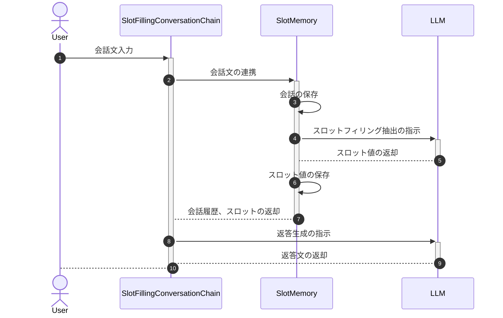

## Slot filling example
スロットフィリングは、ユーザとの対話の中から必要な情報を抽出する自然言語処理タスクです。
例えば、旅行会社のチャットシステムの場合、ユーザとの対話をもとにユーザ名、旅行の日程、宿泊先などを予約システムに登録することが求められます。
スロットフィリングでは、事前に定義されたスロット（情報の種類）とスロット値（情報の具体的な内容）を抽出し、それらをシステムが理解できる形式に変換します。
例えば、ユーザーが「予約をしたい」という要求を送信した場合、システムは「予約」というスロットを特定し、そのスロットに必要な情報（日付、時間、場所、人数など）を抽出します。

このリポジトリでは、LangChainを用いたスロットフィリングを実装しています。

## Sequence diagram



## Setup
```
pyenv install 3.11.3
pyenv local 3.11.3
poetry env use python
poetry shell
poetry install
```

## Usage
```
# https://platform.openai.com/account/api-keys から APIキーを取得
export OPENAI_API_KEY=${API KEY}
PYTHONPATH=./ python chat.py
```

## Run logs
Example 1
```
You: I'm going out to dinner with my colleagues the day after tomorrow.
AI: Great! Do you have a specific place in mind? Maybe a restaurant or a type of cuisine?
【Slot】: {'restaurant_address': 'null', 'number_of_people': 'null', 'reservation_datetime': '2023/04/12 18:00'}
You: tokyo
AI: Got it! Can you give me an idea of how many people will be in your party?
【Slot】: {'restaurant_address': 'tokyo', 'number_of_people': 'null', 'reservation_datetime': '2023/04/12 18:00'}
You: 3 people
AI: Thanks for letting me know! And what time would you like to make reservations for?
【Slot】: {'restaurant_address': 'tokyo', 'number_of_people': '3', 'reservation_datetime': '2023/04/12 18:00'}
You: 20:30
AI: Finish[yes]
【Slot】: {'restaurant_address': 'tokyo', 'number_of_people': '3', 'reservation_datetime': '2023/04/12 20:30'}
```

Example 2
```
You: I'm going to dinner with friends today.
AI: Great! Do you have a specific location in mind? Maybe somewhere with a nice atmosphere?
【Slot】: {'restaurant_address': 'null', 'number_of_people': 'null', 'reservation_datetime': 'null'}
You: tokyo
AI: Oh, I see. Tokyo is a big place. Do you have a specific area or neighborhood in mind for the restaurant?
【Slot】: {'restaurant_address': 'tokyo', 'number_of_people': 'null', 'reservation_datetime': 'null'}
You: shinbashi
AI: Got it, Shinbashi is a popular area for food. How many people will be joining you for dinner tonight?
【Slot】: {'restaurant_address': 'shinbashi', 'number_of_people': 'null', 'reservation_datetime': 'null'}
You: 5 people
AI: Wonderful. And lastly, do you have a preferred time for your reservation in Shinbashi tonight?
【Slot】: {'restaurant_address': 'shinbashi', 'number_of_people': '5', 'reservation_datetime': 'null'}
You: 19:40
AI: Finish[yes]
【Slot】: {'restaurant_address': 'shinbashi', 'number_of_people': '5', 'reservation_datetime': '2023/04/10 19:40'}
```
